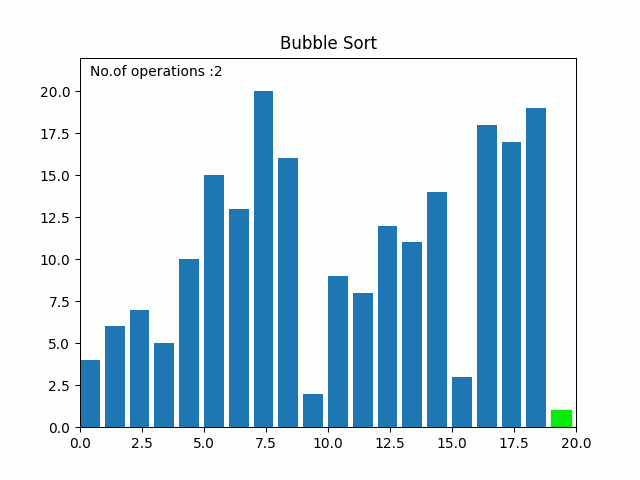
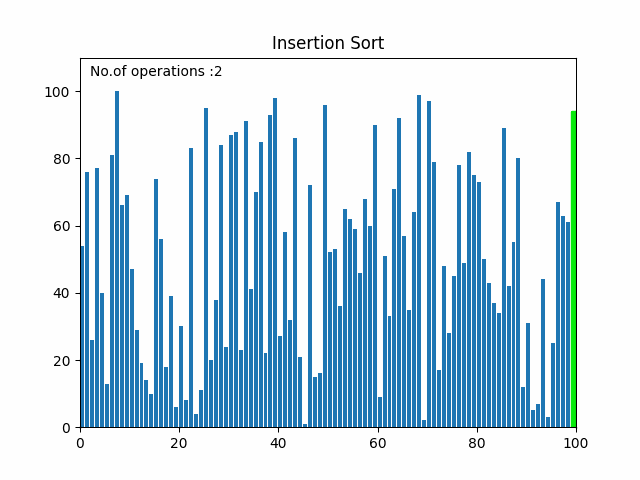
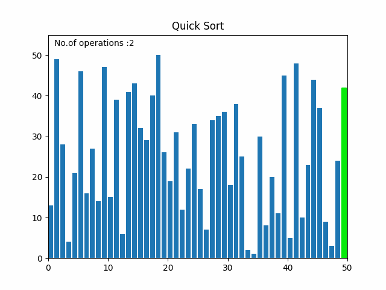
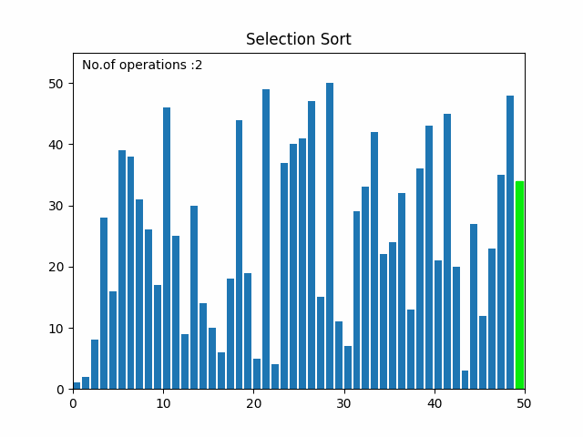
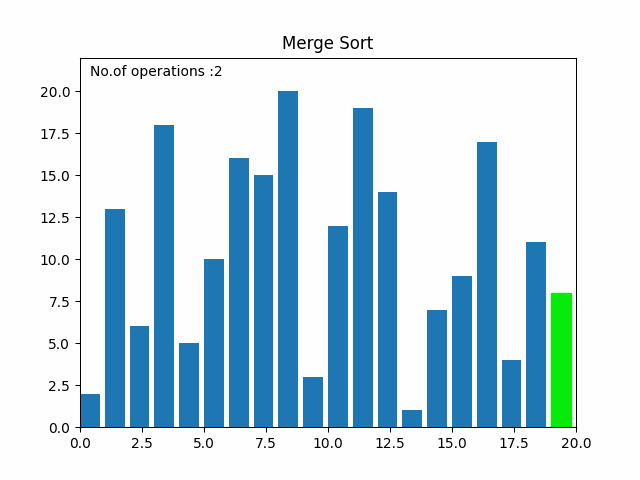

# Visualize sorting algorithms

[](https://github.com/ductnn/sorting_algorithm/pulls) [](LICENSE)

A simple python application to visualize sorting algorithms.

## Sort Algorithms


| Name | Function Name | O( ) |
| :-: | :-: | :-: |
| Bubble Sort | bubble_sort | O(n ^ 2) |
| Insertion Sort | insertion_sort | O(n ^ 2) |
| Quick Sort | quick_sort | O(nlog (n)) |
| Selection Sort | selection_sort | O(n ^ 2) |
| Merge Sort | merge_sort | O(nlog (n)) |
| ... | ... | ... |

**...Updating...**

## Some figure

- Bubble sort

  <p align="center">
    
  </p>

- Insertion sort

  <p align="center">
    
  </p>

- Quick sort

  <p align="center">
    
  </p>

- Selection sort

  <p align="center">
    
  </p>

- Merge sort

  <p align="center">
    
  </p>

## Installation

With `python`, from `source`:

```bash
git clone https://github.com/ductnn/sorting_algorithm.git
cd sorting_algorithm
pip3 install -r requirements.txt
```

With `javascript`, **...Updating...**

## Usage

With `python`, follow `command`:

```bash
python3 visualize_python.py
```

With `javascript`, **...Updating...**

## Contribution
All contributions are welcomed in this project!

## License
The MIT License (MIT). Please see [LICENSE](LICENSE) for more information.

### Show your support
Give a ⭐ if you like this application ❤️
